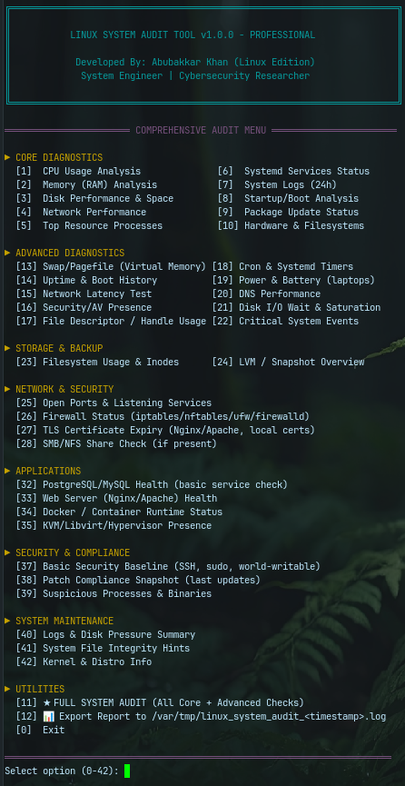

<div align="center">
#🐧 Linux System Audit Tool
[](https://www.gnu.org/software/bash/)
[](LICENSE)
[]()
[](https://github.com/NoneAvobeAll/Linux-System-Audit)
[](https://github.com/NoneAvobeAll/Linux-System-Audit/pulls)

**Enterprise-grade Bash diagnostic tool for Linux servers and workstations.**  
Comprehensive performance auditing, security analysis, and system health monitoring.

[Features](#-features) • [Installation](#-quick-start) • [Usage](#-usage) • [Documentation](#-audit-categories) • [Contributing](#-contributing)

</div>

---

## 🎯 Overview

The **Linux System Audit Tool** is a comprehensive, production-ready diagnostic solution designed for:

- 🔧 **System Administrators** - Troubleshoot performance bottlenecks
- ⚙️ **DevOps Engineers** - Infrastructure health monitoring
- 🔐 **Security Professionals** - Compliance audits and vulnerability scanning
- 🏢 **Enterprise IT** - Server fleet management

### Why This Tool?

- ✅ **42+ Comprehensive Checks** - CPU, Memory, Disk, Network, Security, Applications
- ✅ **Zero External Dependencies** (core features) - Works with built-in Linux tools
- ✅ **Interactive Menu** - Color-coded, user-friendly interface
- ✅ **Detailed Reports** - Export full audit logs to `/var/tmp`
- ✅ **Production-Tested** - Battle-tested on Ubuntu, Debian, RHEL, CentOS, Rocky Linux
- ✅ **Security-Focused** - Detects suspicious processes, open ports, weak configurations
- ✅ **Single Script** - Self-contained, easy to deploy

---

## ✨ Features

### 🔵 Core Diagnostics (Functions 1-10)

| Function | Description | Key Metrics |
|----------|-------------|-------------|
| **CPU Usage Analysis** | Real-time CPU metrics, load averages | `mpstat`, `lscpu`, load averages |
| **Memory (RAM) Analysis** | RAM usage, top consumers, swap pressure | `free -h`, top memory processes |
| **Disk Performance & Space** | I/O stats, space usage, inode analysis | `iostat`, `df -h`, `df -i` |
| **Network Performance** | Interface stats, connectivity tests | `ip addr`, ping tests |
| **Top Resource Processes** | CPU & memory hogs | `ps aux` sorted by usage |
| **Systemd Services Status** | Critical service health checks | `systemctl --failed`, service status |
| **System Logs (24h)** | Error/warning analysis from journalctl | `journalctl -p err -S -24h` |
| **Startup / Boot Analysis** | Boot time, startup services | `systemd-analyze blame` |
| **Package Update Status** | Available updates, last update date | apt/yum/dnf check-update |
| **Hardware & Filesystems** | Disk health, SMART status, block devices | `lsblk`, `smartctl` |

### 🟢 Advanced Diagnostics (Functions 13-22)

- **Swap / Virtual Memory Analysis** - Swap usage, pressure metrics
- **Uptime & Boot History** - Reboot tracking, last boot time
- **Network Latency Test** - Multi-target ping (Google DNS, Cloudflare)
- **Security / AV Presence** - Detect ClamAV, Sophos, CrowdStrike
- **File Descriptor / Handle Usage** - FD limits, processes with most open files
- **Cron & Systemd Timers** - Scheduled job analysis
- **Power & Battery Status** - Battery health (laptops), power management
- **DNS Performance Test** - Resolution speed with `dig` or `getent`
- **Disk I/O Wait & Saturation** - `iostat -xz`, load vs CPU analysis
- **Critical System Events** - Kernel panics, OOM kills, filesystem errors

### 🟡 Storage & Backup (Functions 23-24)

- **Filesystem Usage & Inodes** - Space and inode exhaustion detection
- **LVM / Snapshot Overview** - Logical volume health, snapshot status

### 🔴 Network & Security (Functions 25-28)

- **Open Ports & Listening Services** - `ss -tulpn`, suspicious port detection
- **Firewall Status** - iptables/nftables/ufw/firewalld rules audit
- **TLS Certificate Expiry** - Local certificate scanning (Nginx/Apache)
- **SMB / NFS Share Check** - Mounted network filesystems

### 🟣 Applications (Functions 32-36)

- **PostgreSQL / MySQL Health** - Service status, basic connectivity
- **Web Server Health** - Nginx/Apache/httpd status
- **Docker Container Monitor** - Container status, resource usage
- **KVM / Libvirt Hypervisor** - VM presence detection

### 🟠 Security & Compliance (Functions 37-39)

- **Basic Security Baseline** - World-writable dirs, SSH config, sudo policies
- **Patch Compliance Snapshot** - Last update date, missing patches
- **Suspicious Processes & Binaries** - Processes from `/tmp`, executables in temp

### 🟢 System Maintenance (Functions 40-42)

- **Logs & Disk Pressure Summary** - `/var` disk usage
- **System File Integrity Hints** - Guidance for `debsums`, `rpm -Va`, AIDE
- **Kernel & Distro Info** - `uname -a`, `/etc/os-release`

---

## 🐧 Supported Distributions

| Distribution | Versions | Status |
|--------------|----------|--------|
| **Ubuntu** | 18.04, 20.04, 22.04, 24.04 | ✅ Fully Tested |
| **Debian** | 10 (Buster), 11 (Bullseye), 12 (Bookworm) | ✅ Fully Tested |
| **RHEL** | 7, 8, 9 | ✅ Tested |
| **CentOS** | 7, 8, 9-Stream | ✅ Tested |
| **Rocky Linux** | 8, 9 | ✅ Tested |
| **AlmaLinux** | 8, 9 | ✅ Tested |
| **Fedora** | 37, 38, 39 | ✅ Compatible |
| **Amazon Linux** | 2, 2023 | ✅ Compatible |
| **Oracle Linux** | 7, 8, 9 | ✅ Compatible |
| **openSUSE** | Leap 15.x, Tumbleweed | ⚠️ Partially Tested |
| **Arch Linux** | Rolling | ⚠️ Community Tested |

---

## 📦 Prerequisites

### Required (Built-in)

- **Bash**: 4.0 or later
- **Root/Sudo Access**: Required for full functionality
- **Systemd**: Required for service/timer checks (most modern distros)

### Optional Tools (Auto-Detected)

Install these for enhanced functionality:

```bash
# Debian/Ubuntu
sudo apt install -y sysstat smartmontools lsof bind9-utils

# RHEL/CentOS/Rocky/Alma
sudo yum install -y sysstat smartmontools lsof bind-utils

# Fedora
sudo dnf install -y sysstat smartmontools lsof bind-utils

# Arch Linux
sudo pacman -S sysstat smartmontools lsof bind-tools

# openSUSE
sudo zypper install sysstat smartmontools lsof bind-utils
```

**Tool Benefits:**
- `sysstat` → `iostat`, `mpstat`, `sar` for detailed I/O/CPU stats
- `smartmontools` → `smartctl` for disk health (SMART)
- `lsof` → File descriptor and open file analysis
- `bind-utils`/`bind9-utils` → `dig` for DNS performance tests

---

## 🚀 Quick Start

### 1. Clone the Repository

```bash
git clone https://github.com/NoneAvobeAll/Linux-System-Audit.git
cd Linux-System-Audit
```

### 2. Make Executable

```bash
chmod +x linux_system_audit.sh
```

### 3. Run as Root

```bash
sudo ./linux_system_audit.sh
```

### 4. Select from Menu

```
Select option (0-42): 1    # Run CPU Usage Analysis
Select option (0-42): 11   # Run FULL AUDIT (all checks)
Select option (0-42): 12   # Export report to file
Select option (0-42): 0    # Exit
```

---

## 💻 Usage

### Interactive Mode (Recommended)

```bash
sudo ./linux_system_audit.sh
```

Navigate through the color-coded menu to select individual checks or run a full audit
---

## 📊 Audit Categories

<details>
<summary><b>🔵 Core Diagnostics (1-10)</b></summary>

| # | Function | Output Example |
|---|----------|----------------|
| 1 | CPU Usage | Load averages, CPU model, per-core usage |
| 2 | Memory Analysis | RAM usage, swap, top memory processes |
| 3 | Disk Performance | `df -h`, `iostat`, inode usage |
| 4 | Network Performance | Interface status, ping tests |
| 5 | Top Processes | CPU/memory sorted process list |
| 6 | Services Status | Systemd service health |
| 7 | System Logs | journalctl errors (24h) |
| 8 | Boot Analysis | `systemd-analyze blame` |
| 9 | Updates | Available package updates |
| 10 | Hardware | SMART status, block devices |

</details>

<details>
<summary><b>🟢 Advanced Diagnostics (13-22)</b></summary>

| # | Function | Key Checks |
|---|----------|------------|
| 13 | Swap Analysis | Swap usage, swappiness |
| 14 | Uptime History | Last boot, reboot count |
| 15 | Network Latency | Ping to 8.8.8.8, 1.1.1.1 |
| 16 | Security/AV | ClamAV, Sophos, SSH config |
| 17 | File Descriptors | Open FD count, limits |
| 18 | Cron/Timers | Scheduled jobs |
| 19 | Power/Battery | Battery health (laptops) |
| 20 | DNS Performance | `dig` timing tests |
| 21 | Disk I/O Wait | `iostat -xz`, await metrics |
| 22 | Critical Events | Kernel panics, OOM kills |

</details>

<details>
<summary><b>🔴 Network & Security (25-28)</b></summary>

| # | Function | Security Focus |
|---|----------|----------------|
| 25 | Open Ports | `ss -tulpn`, suspicious ports |
| 26 | Firewall | iptables/nftables rules |
| 27 | TLS Certificates | Expiring certs in `/etc/nginx`, `/etc/ssl` |
| 28 | SMB/NFS | Mounted network shares |

</details>

---

## 📄 Export Reports

### Report Location

```
/var/tmp/linux_system_audit_<timestamp>.log
```

### View Reports

```bash
# View full report
less /var/tmp/linux_system_audit_20251120_124530.log

# Search for errors
grep -i "error\|warning\|critical" /var/tmp/linux_system_audit_20251120_124530.log

# Extract specific section
sed -n '/CPU USAGE/,/MEMORY ANALYSIS/p' /var/tmp/linux_system_audit_20251120_124530.log
```

---

## 🔒 Security Considerations

### Running as Root

This script **requires root/sudo** for:
- Reading system logs (`/var/log`, `journalctl`)
- Accessing hardware info (`smartctl`, `/sys`)
- Network diagnostics (`ss`, iptables)
- Service status checks (`systemctl`)

### Security Best Practices

✅ **DO:**
- Review the script before running: `less linux_system_audit.sh`
- Run in test environment first
- Secure exported reports (contain sensitive info)
- Use version control (Git) to track changes
- Limit network exposure of reports

⚠️ **DON'T:**
- Run untrusted scripts as root
- Share reports publicly (contain IPs, usernames, configs)
- Store credentials in reports
- Execute from untrusted sources

### Sensitive Information in Reports

Reports may contain:
- ⚠️ Internal IP addresses
- ⚠️ Usernames and UIDs
- ⚠️ Open ports and services
- ⚠️ Filesystem paths
- ⚠️ Installed packages
- ⚠️ System configuration details

---

## ⚡ Performance Impact

### Resource Usage

| Metric | Typical Impact | Notes |
|--------|----------------|-------|
| **CPU** | <5% peak | Brief spikes during `ps`, `iostat` |
| **Memory** | <50 MB | Bash interpreter + subprocesses |
| **Disk I/O** | Minimal | Read-only operations |
| **Network** | <1 Mbps | Only for ping/DNS tests |
| **Runtime** | 30-120 seconds | Full audit (42 checks) |

### Production Safety

- ✅ **Read-Only** - No system modifications
- ✅ **No Restarts** - Doesn't restart services
- ✅ **Non-Invasive** - Uses standard Linux tools
- ✅ **Fail-Safe** - Errors don't crash script

---

## 🐛 Troubleshooting

<details>
<summary><b>Permission Denied</b></summary>

**Error:**
```
bash: ./linux_system_audit.sh: Permission denied
```

**Solution:**
```bash
chmod +x linux_system_audit.sh
sudo ./linux_system_audit.sh
```

</details>

<details>
<summary><b>Command Not Found (iostat, mpstat, etc.)</b></summary>

**Error:**
```
iostat not found; install 'sysstat' for detailed I/O stats.
```

**Solution:**
```bash
# Debian/Ubuntu
sudo apt install sysstat

# RHEL/CentOS
sudo yum install sysstat

# Enable sysstat on RHEL-based systems
sudo systemctl enable sysstat
sudo systemctl start sysstat
```

</details>

<details>
<summary><b>journalctl: No Logs Available</b></summary>

**Error:**
```
No journal files were found.
```

**Solution:**
```bash
# Check journald status
sudo systemctl status systemd-journald

# If disabled, enable persistent logging
sudo mkdir -p /var/log/journal
sudo systemctl restart systemd-journald
```

</details>

---

## 🤝 Contributing

Contributions are **welcome and appreciated!**

### How to Contribute

1. **Fork** the repository
2. **Create a feature branch** (`git checkout -b feature/awesome-check`)
3. **Make your changes** and test on multiple distros
4. **Commit** with clear messages (`git commit -m 'Add: PostgreSQL query latency check'`)
5. **Push** to your fork (`git push origin feature/awesome-check`)
6. **Open a Pull Request** with description of changes

### Contribution Ideas

- 🐛 Bug fixes & error handling
- ✨ New audit functions (Kubernetes, cloud providers)
- 📖 Documentation improvements
- 🌍 Multi-language support
- 🧪 Unit tests (bats framework)
- 🎨 Output formatting enhancements

---

## 📜 License

This project is licensed under the **MIT License** - see the [LICENSE](LICENSE) file for details.

---

## 👨‍💻 Author

**Abubakkar Khan**  
*System Engineer | Cybersecurity Researcher*

- 🌐 GitHub: [@NoneAvobeAll](https://github.com/NoneAvobeAll)
- 📧 Contact: [Open an Issue](https://github.com/NoneAvobeAll/Linux-System-Audit/issues)
- 💼 Repository: [Linux-System-Audit](https://github.com/NoneAvobeAll/Linux-System-Audit)

---

## 🙏 Acknowledgments

- Inspired by Brendan Gregg's USE Method
- Performance counter methodology from Linux Performance Tools
- Built with insights from r/linuxadmin and r/sysadmin communities

---

<div align="center">

**⭐ If this tool helped you, please star the repository! ⭐**

Made with ❤️ for the Linux community

</div>